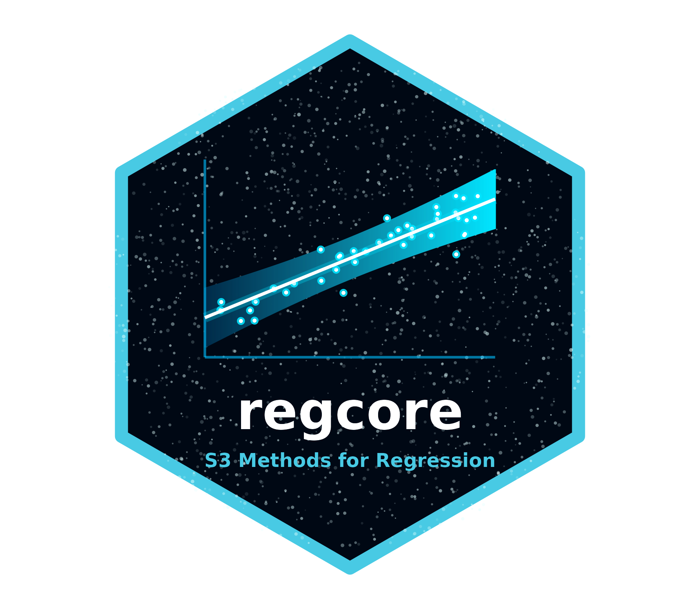

# regcore: Core Generic Functions for Regression R Packages 

<!-- badges: start -->
[](https://github.com/rpetterle/regcore/actions/workflows/R-CMD-check.yaml)
<!-- badges: end -->

**regcore** provides the foundational infrastructure and S3 generic functions for a suite of statistical regression R packages (such as `unitregTMB`, `betamodal`, `uigTMB`, and upcoming packages for other data structures, like continuous positive data). 

By centralizing these generic methods, `regcore` ensures a consistent, standardized user interface and seamless interoperability across different regression frameworks, avoiding code duplication across packages and providing a unified experience for the end-user.

## Provided S3 Generics

This package exports a set of generic functions that downstream regression packages implement. They are categorized into four main areas:

### 1. Model Selection & Comparison
* **`vuong_test()`**: Performs the Vuong test to rigorously compare two non-nested competing models.
* **`pairwise_vuong_test()`**: Conducts pairwise Vuong tests across multiple competing models.
* **`stepCriterion()`**: Performs stepwise variable selection based on information criteria.

### 2. Model Summaries & Extraction
* **`extract_equations()`**: Extracts the full mathematical equations from fitted models (useful for generating LaTeX formulas for academic papers).
* **`summary_coef()`**: Extracts and formats summary coefficients into clean, standard tables.
* **`random_effects()`**: Extracts the predicted random effects from mixed-effects models.

### 3. Diagnostics & Goodness-of-Fit
* **`gof_tab()`**: Computes, extracts, and formats goodness-of-fit statistics.
* **`plot_envelope()`**: Generates simulated half-normal plots (envelopes) for model residuals.
* **`df_envelopes()`**: Extracts the simulated envelope data into a standard `data.frame`, allowing users to build custom, publication-ready grayscale plots using `ggplot2` and `ggh4x`.
* **`plot_ranef()`**: Creates caterpillar plots to visualize random effects and their uncertainties.

### 4. Automated Reporting
* **`write_methods()`**: Automatically generates draft text for the methods section based on the fitted model structure, streamlining academic reporting.

## Installation

You can install the development version of `regcore` from GitHub using the `remotes` package. 

```r
# install.packages("remotes")
remotes::install_github("rpetterle/regcore")
```

## Usage for Package Developers

If you are developing a new statistical regression R package and want to utilize these standardized generics, simply import `regcore` in your `DESCRIPTION` file and define the respective methods for your model object class. 

For example, in your new package:

```r
#' @export
extract_equations.my_new_model <- function(object, ...) {
  # Implementation for your specific model class
}
```

For details on specific methods already implemented, see the documentation in their respective packages.

## License

This package is licensed under the MIT License.
